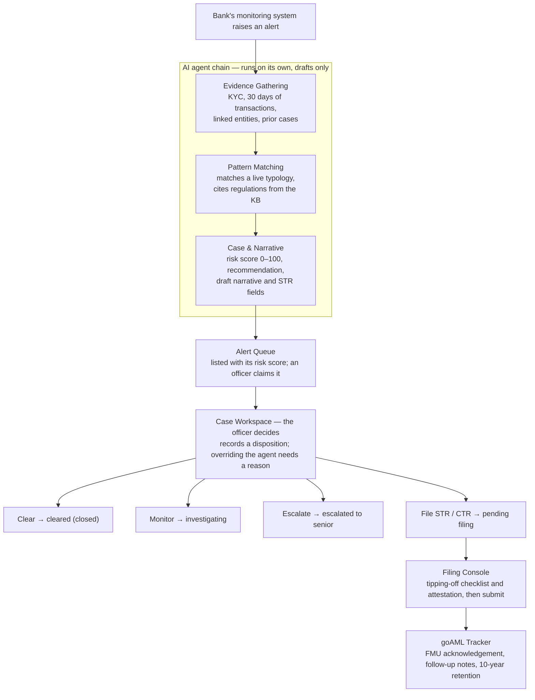

# AML Detection & Filing — User Guide

Last updated 2026-09-27 · Repo copy of the live, editable guide:
https://claude.ai/code/artifact/447ec078-74dd-464c-ba8a-3345d80ac22d
(edit there first, then refresh this file).

AML Detection turns each alert from the bank's transaction-monitoring system into a case that an AI agent chain investigates and drafts, and a human officer decides and files. Nothing is ever filed automatically. This guide covers every screen in the BFSI suite's AML Detection feature, in the order work flows through them.

## 1. How it works

Each alert becomes a case that three AI agents investigate and draft automatically; an officer then makes the decision, and only an officer can file.

The agents never decide a case or file anything. They assemble evidence, suggest the closest money-laundering pattern (typology) and a recommendation, and write a first draft. Every agent step is recorded in the case's activity log.

What the agents know is controlled by the MLRO: the typology catalog (section 10) and the regulations they cite (section 11).

| Case status | What it means |
| --- | --- |
| Open | New; the agents have worked it or are still working |
| Claimed | An officer has taken it |
| Investigating | Decided as enhanced monitoring; stays open work |
| Escalated | Sent to a senior officer |
| Pending filing | Decided as file STR or CTR; waiting in the Filing Console |
| Filed | Submitted to goAML |
| Cleared | Closed with no suspicion |

## 2. Roles

Your role decides which screens appear in your sidebar and what you can do on them; the server enforces the same rules, so a hidden button is never the only protection.

| Role | Demo user | Can do | Screens |
| --- | --- | --- | --- |
| AML Analyst | Amina Raza | Claim alerts; record Clear, Enhanced monitoring or Escalate | Dashboard, Alert Queue, Case Workspace, Customer 360 |
| Senior Compliance Officer | Bilal Siddiqui | Everything an analyst can, plus record File STR / File CTR, complete the filing checklist, attest and submit | + Filing Console, goAML Tracker |
| MLRO / Compliance Head | Fatima Noor | Everything above, plus manage typologies, the kill switch and the Regulatory KB; record sampling reviews; generate reports | Every AML screen |
| Model Risk & Audit | Usman Ali | Read-only oversight: typologies, kill switches and all Model Governance panels | Dashboard, Alert Queue, Typology Console, Model Governance |
| External Examiner | Sana Iqbal | Read-only: the sampling review panel | Dashboard, Alert Queue, Model Governance |

- An analyst who picks File STR or File CTR is refused by the server: filing decisions belong to a senior officer or the MLRO.
- Any MLRO may promote a typology or publish a regulation on their own; a second approver is planned for a later release.

## 3. Getting around

Everything sits inside one platform shell: pick your user, choose the BFSI suite, and the AML Detection screens you are allowed to use appear in the sidebar.

1. **Sign in.** On the Polychoron AI sign-in page, choose a demo user. Each carries one role (section 2). Real single sign-on replaces this in a later release.
2. **Suite and feature.** The suite switcher at the top of the sidebar selects the industry suite (BFSI today). Under it, each feature is a group; AML Detection lists only the screens your role can open.
3. **Your identity.** The foot of the sidebar shows your name and role, and **Log out**. The collapse button narrows the sidebar to icons; your choice is remembered.
4. **Breadcrumbs.** The line above each page title shows where you are, e.g. *Typology Console / structuring_subthreshold / Edit*. Earlier parts are links back.
5. **Global search.** The search box in the top bar finds a case by alert ID, customer ID or customer name and shows up to 8 matches. Press Enter to open the first, or click any match to go to its Case Workspace.
6. **Loading.** A thin bar across the top of the window means the platform is waiting on the server, whether a page is loading or an action such as Claim or Save is in progress. A page or panel still fetching its data shows a spinner with what it is loading.
7. **Notifications.** Success and error messages appear briefly in the corner and disappear after 5 seconds. A failed action never clears the screen behind it.

Most lists page at 10, 25 or 50 rows, with Prev and Next at the foot of the list.

## 4. Dashboard

The Dashboard is the programme's command view: how much work is open, how much is overdue, how many reports went out, and whether officers agree with the agents.

| Panel | What it shows | Why it matters |
| --- | --- | --- |
| Open alerts | Open cases by risk tier: critical, high, medium, low | The size and severity of the current workload |
| STR / CTR volume this period | Suspicious and cash transaction reports filed | Regulatory output for the period |
| Agent / human override rate | Share of dispositions where the officer overrode the agent | A rising rate means the agents need tuning |
| Aging alerts (past SLA) | Open cases past their deadline; turns red when above zero | Cases at risk of breaching the service level |
| Alert volume & STR conversion | Last 6 months: alerts raised, STRs filed, conversion rate | Whether alerts are turning into real reports |
| Agent vs. officer disposition | Agreed with the agent vs. overrode it | Trust in the agents' recommendations |
| False-positive rate | Cases the agent escalated or recommended filing that the officer cleared | Noise the agents create |
| Most aging alerts | The 3 most overdue open cases | Click one to open its Case Workspace |
| Branch risk heat-map | Open cases per branch by risk tier, 10, 25 or 50 branches a page | Where risk is concentrating |

Clicking **Open alerts** or **Aging alerts** opens the Alert Queue. A new tenant with no cases sees a short next-step prompt instead of empty tiles.

SLA deadlines depend on the risk score: critical 24 hours, high 48, medium 96, low 168 (7 days), counted from when the alert arrived.

## 5. Alert Queue

The Alert Queue is where work starts: it lists cases newest first, lets you narrow them to what you should work on, and lets you claim one so colleagues know it is yours.

**Each row** shows when the alert was received (date, time and age), the risk score, the matched typology, the customer and account, the agent's recommendation with its confidence, the case status, the SLA timer, the assignee and the bank's alert ID. Click a row to open its Case Workspace; click the customer's name to open Customer 360.

**Views** are one-click presets across the top:

| View | Shows |
| --- | --- |
| Open work (default) | Every case not yet cleared or filed |
| My cases | Open cases assigned to you |
| Unassigned | Open cases nobody has claimed |
| Past SLA | Open cases past their deadline |
| Needs attention | Cases where the agents didn't finish or the kill switch sent them to manual review |
| All cases | Every case, including cleared and filed |

**Filters** narrow any view; changing one after picking a view shows *Custom filters*:

- Search by alert ID, customer ID or name, or the start of a case ID.
- Status, risk tier (including *unscored*), typology (including *no match*), recommendation and agent state each allow several choices at once.
- Assignee: anyone, me, unassigned, or a named colleague.
- Received: today, last 7 days, last 30 days, or a custom from–to range.
- SLA: past due, or due within 24 hours.

Each active filter appears as a chip you can remove with ×, and **Clear all** returns to Open work. Filters, sorting and the page are kept in the address bar, so you can bookmark a view or send the link to a colleague.

**Sorting:** click Received, Risk, Customer, Status or SLA to sort by it; click again to reverse. Unscored cases always sort last.

**Claiming:** click **Claim** on an unassigned case to take it; its status moves from Open to Claimed and your name replaces the button.

**What a missing risk score means:**

| Shown instead of a score | Meaning | What to do |
| --- | --- | --- |
| processing… | The agents are still working (activity in the last 15 minutes) | Wait, or open it to see progress |
| agent didn't finish (red) | The agents started but produced no assessment | Review the case manually |
| manual review (kill switch) | The kill switch was on when it arrived | Review the case manually |
| no agent record | A closed case the agents never worked, e.g. decided before AML Detection | Nothing; it is history |

**Pinned cases:** an open case marked *evidence incomplete* stays at the top whatever the sort, because the agents couldn't reach every data source and a person must look first.

**New alerts:** the list never reorders by itself. Every minute it checks for new cases matching your filters and shows *N new alerts — Show*; click Show when you are ready.

The agent's recommendation is only ever a label here, never a pre-selected action.

## 6. Case Workspace

The Case Workspace is where an officer reads what the agents found and makes the decision; the agents' work is shown read-only and visibly marked as AI-drafted, and only the officer's disposition changes the case.

**Header:** the alert ID, the case status, the customer's name (click it for Customer 360) and the composite risk score (0–100) with its bar.

**Left panel — Evidence (AI-assembled, read-only):**

| Panel | What it holds |
| --- | --- |
| Customer summary | KYC: name, CNIC, declared occupation and turnover, risk rating, account opening date, address |
| Transaction timeline | The last 30 days: reference, amount, channel, branch, time |
| Linked entities | People and businesses connected to the customer, drawn as a graph |
| Prior cases | Earlier cases on this customer and how they were decided |
| Sanctions · PEP · adverse media | Screening matches with their confidence, or *Clean* |

Long lists page at 5 or 10 rows. If the agents didn't finish, the kill switch was on, or the case predates AML Detection, a note at the top of the panel says so instead of the evidence.

**Right panel — Reasoning + decision.** A legend separates the two voices: hatched = AI-drafted, solid = officer.

- **Typology match (AI-drafted):** the matched pattern, the agent's plain-language rationale and each matched indicator with the evidence behind it.
- **AI-drafted narrative (read-only):** the draft story of the case, with the recommendation and its confidence — labelled advisory; your disposition governs.
- **Disposition (you):** choose one, write your notes, then confirm. Nothing is submitted until you do.

| Disposition | Effect | Who |
| --- | --- | --- |
| Clear | No suspicion; the case closes | Any officer |
| Enhanced monitoring | 90-day watch with lowered thresholds; stays open as Investigating | Any officer |
| Escalate to senior officer | A senior officer reviews it before any filing | Any officer |
| File STR | Suspicious Transaction Report to the FMU; opens the Filing Console | Senior officer, MLRO |
| File CTR | Currency transaction report only, no suspicion stated; opens the Filing Console | Senior officer, MLRO |

**Officer notes are required**, and they are stored separately from the agent's narrative, so re-running the agents never overwrites them.

**Overriding the agent:** if you choose a disposition different from the agent's recommendation, a reason box appears and must be filled before you can confirm. The reason is kept in the audit record and counts toward the Dashboard's override rate.

**After deciding,** the panel shows the recorded disposition, your notes and any override reason instead of the buttons. A case pending filing shows **Go to Filing Console**.

**Agent activity log:** *Show agent activity log* lists every agent step — agent and version, model provider, time taken, confidence and the data sources it used.

Regulatory citations the agent relied on are recorded with the case but are not shown on this screen yet; see which cases cite a regulation from its Knowledge Base page (section 11).

## 7. Customer 360

Customer 360 shows everything the bank's AML history holds on one customer across all of their cases, so a decision on today's alert can take the customer's whole record into account. It is read-only.

Open it by clicking a customer's name in the Alert Queue or in a case header. Each customer has its own address, so you can bookmark it for an audit file.

| Panel | What it holds |
| --- | --- |
| Header | Name and CNIC |
| Summary tiles | Current risk score, number of accounts, prior cases and filings |
| KYC snapshot | The latest KYC across cases: occupation, declared monthly turnover, KYC risk, address, account opening date |
| Accounts | Every account seen on this customer's alerts, each linked to the cases that mention it |
| Case history | Every case, with typology, opened and closed dates and the final disposition; click one to open it |
| Linked entities (aggregated) | Connected people and businesses gathered from all of the customer's cases, as a graph |
| Screening history | Sanctions and PEP hits across their cases, with the case and its outcome; *No prior sanctions/PEP hits* when clean |

Accounts, case history and screening history page at 10, 25 or 50 rows. Accounts are derived from the alerts; the bank's core system is not queried for a full account list in this release.

## 8. Filing Console

The Filing Console turns a *File STR* or *File CTR* decision into a report for the FMU; a senior officer or the MLRO reviews the pre-filled draft, confirms nobody has tipped off the customer, attests, and submits. Submission cannot be recalled.

Open it from the case's **Go to Filing Console** button, which appears once a filing disposition is recorded. Analysts cannot open it.

1. **Case summary (read-only):** filing status, risk score and the agent's recommendation, with a link back to the case.
2. **STR-F fields (officer-editable):** party name, CNIC, address and occupation, total amount and the typology tag, pre-filled by the agent. Changing the typology tag is recorded in the filing's edit trail with the old and new value.
3. **Suspicion narrative:** the agent's draft, which you edit; it goes to the FMU word for word.
4. **Tipping-off checklist and attestation** — all four boxes are required:
    - No branch staff, relationship manager or call-centre agent has contacted the customer about these transactions.
    - No account freeze, hold, closure or restriction has been applied since the alert was raised.
    - The existence of the report has not been disclosed to the customer or anyone outside compliance.
    - Your attestation that the narrative, including any agent-drafted text, is adopted as your own statement.

**Save draft** keeps your edits and ticks without submitting; come back any time. **Submit** stays disabled until all four boxes are ticked, and the server checks them again on submission, so an incomplete attestation is refused even if the button were enabled.

On submission the filing receives a goAML reference, the case becomes *Filed*, the report is kept for 10 years from the submission date, and you land on the goAML Tracker. Revisiting a submitted filing shows its status read-only.

## 9. goAML Tracker

The goAML Tracker follows every submitted report through the regulator's pipeline and keeps its record for the 10-year retention period. Senior officers and the MLRO can open it.

**Portfolio strip:** filings on record, awaiting acknowledgement, acknowledged, and how many are within 90 days of their retention review. These count every filing, not just the page on screen.

**Filings list** (20 a page by default): report type, case, a three-step progress marker (Submitted → Acknowledged by FMU → Feedback received), the goAML reference, and an **R** flag when the filing is within 90 days of its 10-year disposal review. Click a filing to see its details.

**Filing detail:** goAML reference, status, submitted and acknowledged dates, retention expiry, and a link to the case.

**FMU follow-up log:** type a note and press **Add** to record any correspondence with the FMU. Notes are dated, show who wrote them, and cannot be edited or deleted.

**Simulate acknowledgment (demo only):** marks a submitted filing as acknowledged by the FMU, standing in for goAML's real response. The Feedback received step is reserved for the live goAML connection.

## 10. Typology & Rules Console (MLRO)

A typology is a named money-laundering pattern whose plain-language rule text the Pattern Matching Agent reads on every alert, so changing one changes what the platform detects. The console makes every change a draft that must pass a regression test before an MLRO promotes it. Model Risk & Audit can read everything here but change nothing.

**Library** (*Typology Console* in the sidebar): each typology with its status, live version, 30-day alert volume, STR conversion and false-positive rate. Filter by status (live, retired, not yet live, draft open), *tuning candidates only* (conversion under 10%), or search. Rows with conversion under 10% or false positives over 50% are highlighted. Click a row to open it.

| Status | Meaning |
| --- | --- |
| Live | Promoted and offered to the agent |
| Retired | Promoted as inactive; the agent no longer uses it |
| Not yet live | Created but never promoted; the agent has never seen it |
| Kill-switched | Stopped immediately by the kill switch, whatever its version |

**Typology view:** the live version (solid border), any open draft (hatched) with its changes highlighted against live, the latest backtest, how many regression test cases cover it, and the version history. From the history, *Compare with live* shows any two versions side by side.

**Making a change:**

1. **New typology** (Library) or **Edit** (typology view). A new typology needs a permanent code (lowercase letters, digits and underscores), a label, the rule text and a reason; it starts as draft v1. Editing opens a draft copied from the live version, or continues the open one.
2. **Edit the draft:** label, rule text, the *Active* box (untick to retire) and *what changed and why*. **Save draft**. Nothing reaches the agent yet.
3. **Run golden-dataset regression.** Every regression test case runs through the real agents with your draft in the catalog; it takes a few minutes and shows progress and per-case results. Editing the draft afterwards marks the result *stale*.
4. **Start backtest** (optional): the typology's agreement rate against past officer decisions. Promoting without one is allowed but recorded as *no backtest*.
5. **Promote.** Enabled only when the regression has passed for the draft exactly as saved. Give a reason; the new version goes live for every alert from then on and the old one is kept as superseded.

**Discard draft** throws away a draft (with a reason); the live version is unchanged and the draft stays in history.

**Kill switch:** **Disable now** on a typology takes it out of the agent's catalog immediately, with no draft or regression — an emergency stop. The Library's banner can also disable the whole of AML Detection for the tenant, sending every new alert to manual review. Both need a reason and can be reactivated.

If no regression test case covers a typology yet (always true for a new one), the checklist warns that the regression only proves the other typologies still behave; test cases are added by the platform team in this release.

## 11. Regulatory Knowledge Base (MLRO)

The Knowledge Base holds the regulations the Pattern Matching Agent may cite, split into passages (chunks) it can search by meaning. Only published documents that are *available to agents* are ever searched; drafts, superseded and withdrawn versions never are. Only the MLRO can open it.

**Library** (*Regulatory KB*): every document with its status, version, issuer and counts. Filter by status, source type and issuer, or search titles, tags and section references; filters stay in the address bar. Click a row to open it; **Add document** starts the wizard; a saved draft resumes where you left off.

**Adding a document — six steps.** The draft is saved on the server from step 1, so you can leave and resume from the Library.

| Step | What you do |
| --- | --- |
| 1 Source | Upload a PDF, DOCX or TXT (up to 20 MB; PDFs need a text layer, scans are not read), paste the full text, fetch one URL once (up to 10 MB), or write chunks by hand. Text is extracted immediately and a character count and excerpt shown. |
| 2 Metadata | Title, source type (statute, regulation, circular, guidance, international), issuing authority, version label, effective date, source URL, jurisdiction, language, typologies, tags, and internal notes that agents never see |
| 3 Chunking | How the text is split: by a heading pattern (with a live count of matches), by paragraph, or at a fixed size; chunk size limits, overlap, how section references are named, and stripping page numbers and running headers. Save settings as a reusable profile. |
| 4 Preview & adjust | Edit, split at the cursor, merge with next, add, move or delete chunks. Chunks are paged 10, 25 or 50 at a time inside a scrolling frame, with *Needs attention only* and *Go to chunk*. Text that looks like an instruction to an AI is flagged and must be acknowledged. |
| 5 Retrieval settings | *Available to agents* (on/off), *retrieval priority* 0.5–2.0 (1.0 default; raises or lowers the document in the agent's ranking, e.g. binding law above guidance), and optional typology restriction |
| 6 Review & publish | Check everything, then **Save draft** or **Publish**. Publishing embeds any unembedded chunks first, with a progress bar. |

Publishing needs a title, issuing authority, version label, source URL, at least one chunk and every injection flag acknowledged.

**Document view:** status banner, metadata, chunks (searchable, paged) each with how many cases cite it, version timeline, metadata change log, the cases that cite this document, and **Test retrieval**, which shows what the agent would get for a query you type.

| The document is | You can |
| --- | --- |
| Draft | Continue editing, discard, publish |
| Current (published) | Edit metadata, start a new version, re-embed, withdraw |
| Superseded or withdrawn | Read only; kept so decided cases stay explainable; link to the version in force |

**Changing a published document** never alters its text. *Edit metadata* corrects details in place and requires a reason, logged field by field. *New version* opens a draft copy; publishing it supersedes the old version, which remains readable. *Withdraw* takes a document out of use with a reason.

**Compare** shows two versions side by side: metadata differences, then chunk-by-chunk changes with word-level highlights.

The typology restriction currently excludes a document only when none of its typologies is live; per-typology filtering is planned.

## 12. Model Governance & Audit

Model Governance is the audit record of how well the agents perform and how the platform controls them, over a trailing 6-month window; every figure is computed from live data. The MLRO and Model Risk & Audit see every panel; an External Examiner sees the sampling panel only.

| Panel | What it shows | Action |
| --- | --- | --- |
| Model version in production | Each agent's version and model provider in use, with version and change history | — |
| Sampling & drift check | 20% of cleared cases are selected for a second look. Shows how many were sampled, reviewer agreed / disagreed, the 6-month agreement-rate trend and a drift assessment | MLRO: **Review** a selected case, mark *agree* or *disagree* with the original clearance, add notes |
| Consistency check | STR conversion by typology, broken out by branch; a branch more than 10 percentage points from that typology's average is flagged | — |
| Data lineage & feed status | Every source the agents read (mock bank feeds, workflow engine, model provider), what they take from it and when it last refreshed; stale after 24 hours | — |
| Golden-dataset regression history | Each regression run: what was tested, when, passed / failed counts and status | — |
| Fairness flags | Customer segments (occupation, branch, account type) whose STR-recommendation rate deviates from the baseline; for human review only, never an automatic action | — |
| Guardrail violations | Prompt-injection attempts found in evidence (G1) and citations the agent invented that were stripped (G3), with severity | — |

A sampling disagreement is the strongest signal that clearances need attention; a rising disagreement rate shows in the drift assessment.

## 13. Reporting & MI

Reporting & MI gives the MLRO period figures for management and regulators, drawn from filed records with the same calculation the Dashboard uses, and produces reports whose numbers are fixed at the moment they are generated.

**Choose the period:** this month, this quarter (default) or a custom range; optionally compare against the preceding equal period, which adds change indicators to the headline figures.

| Panel | What it shows |
| --- | --- |
| Headline figures | STR-F filed, CTR filed, average time to file, SLA adherence |
| Breakdown | Filings by type, typology or branch (switchable) |
| Filing volume | STR-F and CTR filings by month |
| SLA adherence by risk tier | Alerts decided within their target vs. breached, from alert to disposition |
| Agent workload split | How dispositions divided between agreeing with and overriding the agent |
| Report history | Every report generated, 10 a page |

**Generating a report:** give it a name and click **Generate report**. A CSV is produced for the chosen period and breakdown, stamped with a content hash, and added to Report history.

**Report history:** name and period, who issued it and when, format and hash, and **Download**. A report downloads byte-for-byte as issued; its figures are never recalculated, even if later data changes. A regulator-specific (SBP) template is planned once the format is provided.

## 14. Safeguards you will see

The platform enforces these rules for you; each one is also checked on the server, so none depends on a button being hidden.

| Rule | What you see |
| --- | --- |
| A human decides and files; nothing is filed automatically | Recommendations are labels, never pre-selected; only an officer's confirmed disposition and submission move a case |
| AI work is always distinguishable from yours | Hatched *AI-drafted* panels vs. solid officer panels; the agent narrative is read-only and kept apart from your notes |
| Overriding the agent needs a reason | The reason box appears when your choice differs, and confirm stays disabled until it is filled |
| Filing decisions need a senior officer | Analysts don't see File STR / File CTR; the server refuses them too |
| No tipping-off | Four required checklist boxes before Submit is enabled |
| Every agent step is recorded | The case's agent activity log |
| Injected instructions are neutralised | Instruction-like text in evidence is treated as data and logged; in the KB it must be acknowledged before publishing |
| Citations must be real | A citation the agent didn't actually retrieve is stripped and logged (Model Governance → guardrail violations) |
| Incomplete evidence is never passed off as complete | *Evidence incomplete* label; such open cases are pinned to the top of the Alert Queue |
| An emergency stop exists | Kill switch per typology or for the whole feature; affected cases show *manual review (kill switch)* |
| Detection rules change only after testing | Typology changes go through a draft and a passing regression before promotion |
| Cited regulations never change under a case | Published chunk text can't be edited; a change is a new version, and old versions stay readable |
| Issued reports and filings stay as issued | Reports download byte-for-byte; filings are kept 10 years, follow-up notes can't be edited |
| Your list doesn't move under you | The Alert Queue announces new alerts instead of reordering |

## 15. Limits of this release

This release is a working demonstration: the decision and filing workflow is real, but the bank, the regulator and sign-in are simulated, and a few screens don't yet show everything the platform records.

**Simulated**

| Area | In this release |
| --- | --- |
| Bank data | A mock core-banking feed with demo customers; no live bank connection |
| goAML | Submission returns a demo reference (GOAML-DEMO-…); acknowledgement is simulated from the tracker |
| Sign-in | Demo users with fixed roles; single sign-on and user administration come later |
| Sanctions and PEP screening | Screening results are empty; the Screening Hub is not built yet |

**Not yet on screen or not yet built**

| Area | Limit |
| --- | --- |
| Case Workspace | Regulatory citations are recorded but not shown; the *evidence incomplete* warning shows in the Alert Queue but not on the case |
| Filing Console | The typology tag list offers only the two original typologies, not ones created in the console |
| Dashboard | Tiles open the Alert Queue unfiltered rather than pre-filtered |
| Global search | Finds alert ID, customer ID and name; CNIC is not searchable despite the hint |
| goAML Tracker | The *Feedback received* step awaits the live goAML connection |
| Typology Console | Regression test cases are added by the platform team; promotion needs one MLRO, no second approver; shadow-mode testing on live traffic is not built |
| Knowledge Base | The typology restriction only excludes a document when none of its typologies is live |
| Guardrails | Confidence thresholds for routing use fixed defaults and can't be changed on screen |
| Model Governance | Fairness figures appear only when computed; no scheduled run yet |
| Reporting | Generic CSV only; the SBP template waits for the official format |

## 16. Glossary

| Term | Meaning |
| --- | --- |
| Alert | A flag raised by the bank's transaction-monitoring system (TMS); each becomes one case |
| Agent | An AI step that gathers evidence, matches a typology or drafts a narrative; it never decides or files |
| Backtest | A typology's agreement rate against past officer decisions |
| Chunk | One passage of a regulation, the unit the agent searches and cites |
| CNIC | Pakistan's Computerised National Identity Card number |
| CTR | Currency Transaction Report: a threshold cash report, no suspicion stated |
| Disposition | The officer's decision on a case: clear, enhanced monitoring, escalate, file STR or file CTR |
| Embedding | A numeric form of a chunk's meaning that lets the agent search by meaning |
| FMU | Financial Monitoring Unit, Pakistan's financial intelligence unit, which receives reports |
| goAML | The FMU's reporting system |
| Golden dataset | Fixed test cases with known right answers, used for regression tests |
| Kill switch | An immediate stop for one typology or the whole feature; cases go to manual review |
| KYC | Know Your Customer: the customer's identity and profile |
| MLRO | Money Laundering Reporting Officer, the head of compliance |
| Override | A disposition different from the agent's recommendation; needs a reason |
| PEP | Politically Exposed Person |
| Promotion | Making a typology draft the live version |
| Regression | Running every golden test case through the agents to check a change breaks nothing |
| SLA | The deadline to decide a case: 24 h critical, 48 h high, 96 h medium, 168 h low |
| STR | Suspicious Transaction Report (STR-F is its goAML form) |
| Tipping-off | Alerting a customer that they are reported, which is prohibited |
| Typology | A named money-laundering pattern with a rule the agent matches against |
